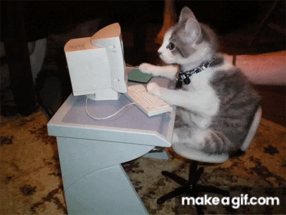
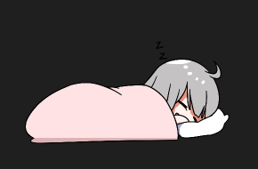

## programas:
### 1.

#### capturas:
 

#### diagrama:

### 2

#### capturas:

#### diagrama:

### 3.

#### capturas:
 

#### diagrama:

### 4.

#### captura:

#### diagrama:

### 5.

#### captura:

#### diagrama:

## Estructuras:
 - todos los códigos están en sus respectivos "programa.py"

## Foto del autor:
