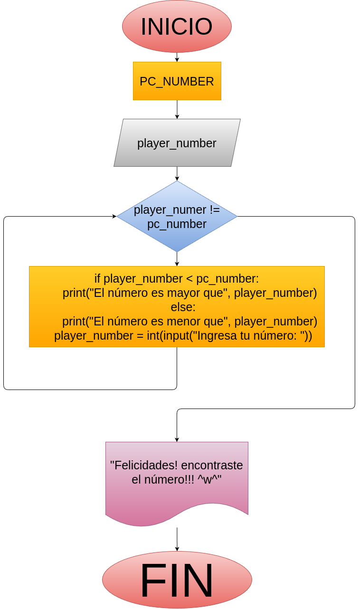
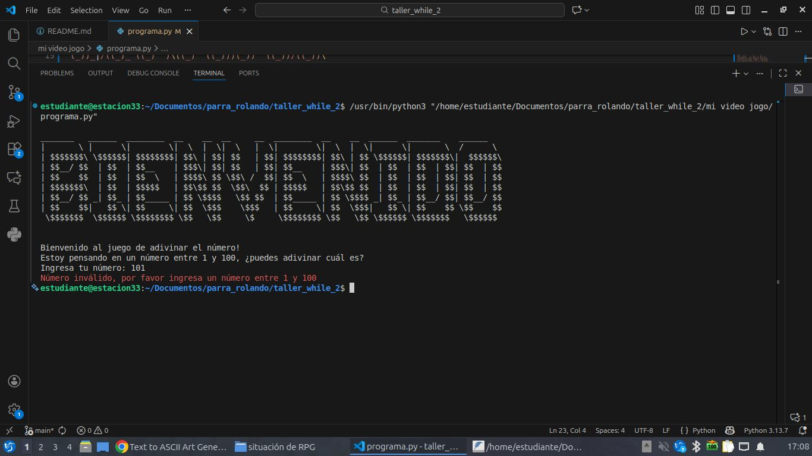

## Análisis

### Variables de entrada:
 - pc_number
 - player_number

### Processing
 - while player_number != pc_number

### Output
 - "felicidades! adivinaste el número!!! ^w^"

## Diagrama:

## Capturas:

