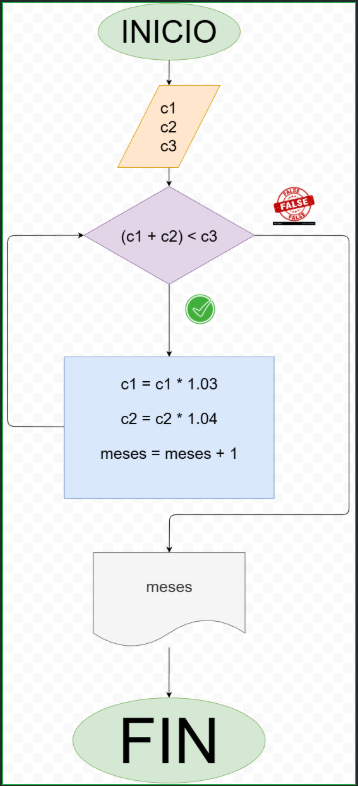
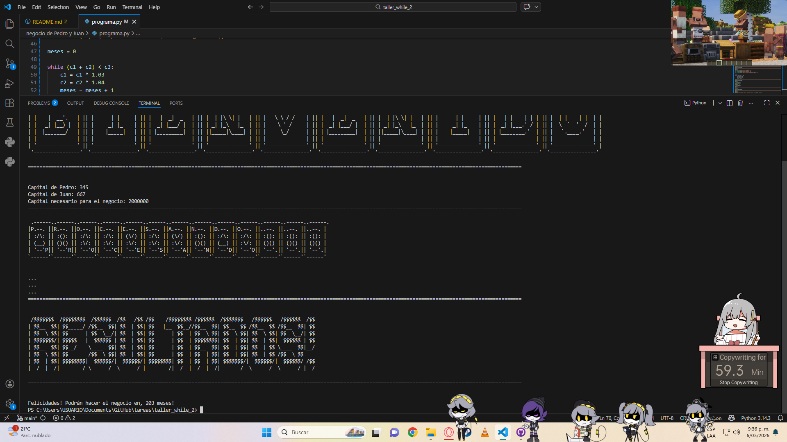

 - programa en Python para calcular **stonks**

## Análisis

### Variables de entrada:
 - $c1$
 - $c2$
 - $c3$
 - meses

### Processing:
while (c1 + c2) < c3:
    c1 = c1 * 1.03
    c2 = c2 * 1.04
    meses = meses + 1

### Output:
 - meses

## diagrama

## screenshot

## construcción
 - código implementado en el archivo "programa.py"