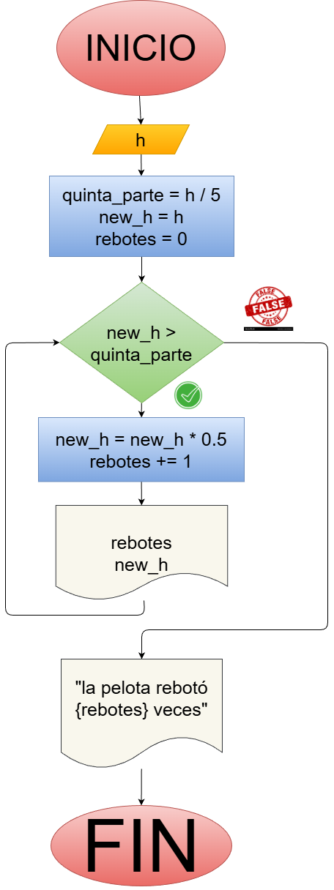
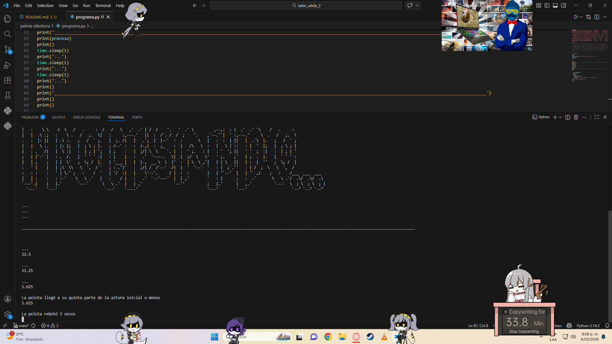

 - programa en Python para calcular en cuantos rebotes una pelota que cae de una altura **$h$** llega a su quinta parte

## Análisis

### Variables de entrada:
 - $h$
 - $new_h$
 - $rebotes$

### Processing:
 - while new_h > quinta_parte:
      new_h = new_h * 0.5
      rebotes += 1

### Output:
 - $new_h$
 - $rebotes$

## Diagrama:

## Scheenshot del programa:
