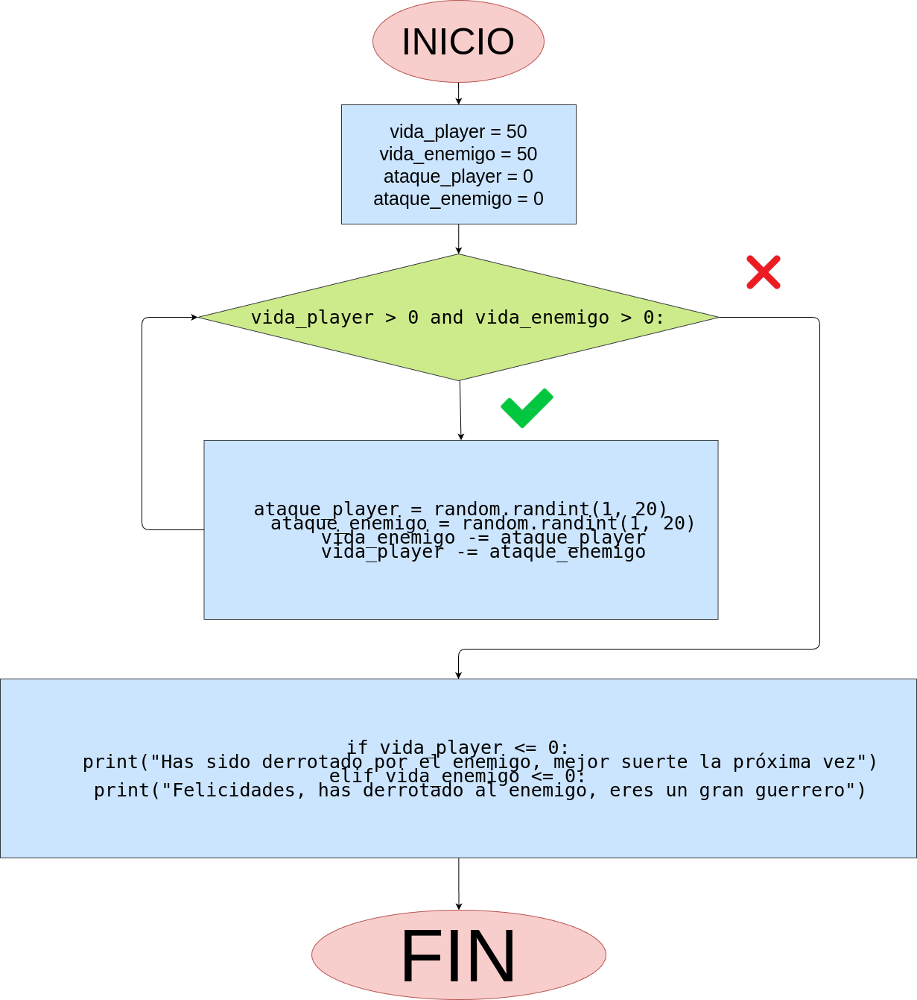

## Análisis:
### Variables de entrada:
 - vida_player
 - vida_enemigo
 - ataque_player
 - ataque_enemigo

### procesing:
while vida_player > 0 and vida_enemigo > 0:
    ataque_player = random.randint(1, 20)
    ataque_enemigo = random.randint(1, 20)
    vida_enemigo -= ataque_player
    vida_player -= ataque_enemigo
    
    if vida_player <= 0:
        break
    if vida_enemigo <= 0:
        break

### Output:
 - vida_player
 - vida_enemigo
 - ataque_player
 - ataque_enemigo

## Diagrama:

## Capturas:

## estructura:
 - todo el código está en el archivo "programa.py"