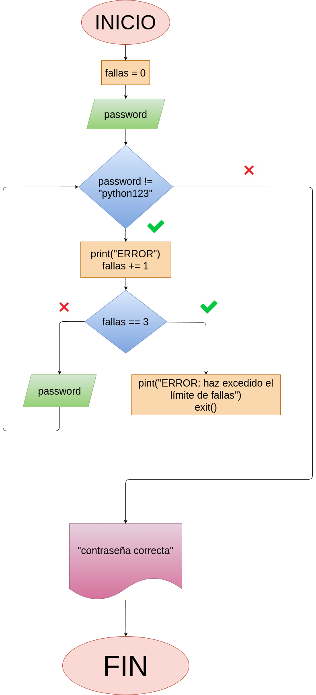

## Analisis:

### Variables de entrada:
 - password
 - fallas

### Processing
 - while password != "python123":
    print("ERROR: Contraseña incorrecta, por favor intente de nuevo")
    fallas += 1
    if fallas == 3:
        print("ERROR: Haz excedido el límite de intetos, el programa se auto destruirá")
        time.sleep(1)
        print("3")
        time.sleep(1)
        print("2")
        time.sleep(1)
        print("1")
        time.sleep(1)
        print("<------------------BOOM------------------>")
        exit()
    password = input("Ingrese la contraseña: ")

### Output:
 - "boom"
 - "Contraseña correcta, bienvenido señor Presidente"

## Diagrama:

## Capturas de funcionamiento:

## estructura:
 - todo el código está en el archivo "programa.py"